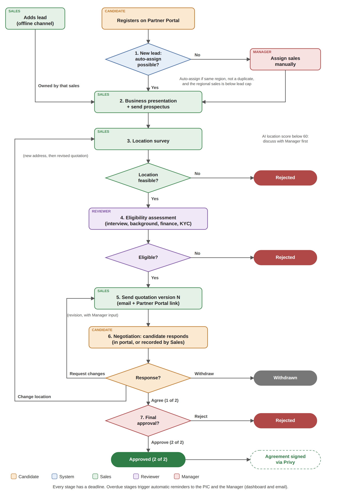

# Kopi Koma Partner Portal: Product Requirements Document

## Table of Contents

[[TOC]]

[[PAGEBREAK]]

## Executive Summary

**Kopi Koma Partner Portal** is a web application that digitalizes and centralizes the partnership process between Kopi Koma (fictitious name), a local coffee franchisor, and its candidate franchisees, from the first application until the partnership is approved by both parties. It consists of two connected applications:

- **Franchisor Dashboard**: used by Sales, Reviewer, Manager, and Super Admin to capture and assign leads, process each pipeline stage, give final approval, and monitor targets.
- **Partner Portal**: used by candidate franchisees to register, track their application, and respond to quotations.

It addresses three core pain points: leads scattered across WhatsApp and personal spreadsheets, applications stuck with no clear owner or deadline, and quotations approved by chat with no traceable agreement.

For the business, this is a growth tool: Kopi Koma grows by opening outlets through partners, so every lead that is not lost and every day cut from the process turns directly into more outlets and revenue, without adding more sales.

Out of scope: everything after both parties approve (agreement signing, outlet opening, royalty). Signing through Privy is shown only as the next step.

**Prototype (Franchisor Dashboard):** https://kopikomapartnerportal.vercel.app

**Prototype (Partner Portal):** https://kopikomapartnerportal.vercel.app/mitra

**Demo password:** demo123 (all staff accounts are listed on the login page)

## Assumptions

### Client

| Item | Assumption |
|---|---|
| Brand | Kopi Koma (fictitious), a local grab-and-go coffee brand with around 80 outlets |
| Packages | **Gerobak** (cart): Rp 45 million, no royalty (earns from mandatory raw material supply instead). **Cafe**: Rp 450 million, 5% monthly royalty |
| Team | 1 Manager, 4 Sales (2 senior, 2 junior, one region each), 2 Reviewers, 1 Super Admin |
| Target | 120 new outlets per year (72 Gerobak, 48 Cafe), a stretch target |
| Revenue | Deal value of approved packages after discount. Royalty is not counted. |

Franchising is the main expansion channel for Indonesian F&B: the culinary sector makes up 47.77% of the 311 registered franchisors as of February 2025 [1][2], and chain coffee shops grew from around 1,000 outlets in 2016 to over 2,950 in 2019 [3][4]. For a brand like Kopi Koma, the partnership process is therefore a core business process.

### Pain points

| # | Pain point | Impact |
|---|---|---|
| 1 | Leads are scattered and not centralized: they live in each sales' WhatsApp, notes, and spreadsheets. | Leads are forgotten, two sales contact the same candidate, data is lost when a sales leaves. |
| 2 | Candidates do not know their application status. | They keep asking sales, and serious candidates may leave. |
| 3 | Quotations and approvals are negotiated by chat. | No single agreed version, approvals cannot be traced. |
| 4 | No deadline per stage. | Applications get stuck unnoticed. |
| 5 | Screening and location decisions rely on individual judgment. | Inconsistent decisions, outlets in weak locations. |
| 6 | Targets are checked only at month end. | The team finds out too late. |
| 7 | Prospectus delivery and data consent are not recorded. | Legal risk under PP No. 35/2024 [5] and UU PDP No. 27/2022 [6]. |

## Human vs System

| Capability | Manual (current) | System | Notes |
|---|---|---|---|
| Capture leads in one place | ⚠️ Limited | ✅ | All leads, from sales or the portal, in one pipeline |
| Assign leads by region, detect duplicates | ❌ Not available | ✅ | Automatic, with exceptions sent to the Manager |
| See stage and owner of every application | ⚠️ Limited | ✅ | Pipeline board shows PIC and days waiting |
| Deadlines and reminders | ❌ Not available | ✅ | Automatic reminders to PIC and Manager when overdue |
| Record prospectus delivery | ⚠️ Limited | ✅ | Required confirmation with date |
| Consistent candidate and location assessment | ⚠️ Limited | ✅ | Structured forms and AI fit score with reasons |
| Quotation versions | ⚠️ Limited | ✅ | Every version kept, revisions need Manager input |
| Candidate checks status | ❌ Not available | ✅ | 7-step tracker in the portal |
| Candidate responds to quotation in writing | ⚠️ Limited | ✅ | Agree, request changes, or withdraw in the portal |
| Trace two-party approval | ⚠️ Limited | ✅ | Approval 1 of 2 (candidate) and 2 of 2 (Manager) logged |
| Monitor target during the period | ⚠️ Limited | ✅ | Achievement vs target to date, per sales and package |
| Audit trail and document access log | ❌ Not available | ✅ | Every action and document access logged |

## Business Impact

Kopi Koma's growth equals the number of new partner outlets. The product supports growth through five levers:

| Lever | How the product drives it | Growth effect | Metric to watch |
|---|---|---|---|
| Fewer lost leads | Every lead is recorded and assigned within 1 day, with reminders when it stalls | More candidates reach the quotation stage | Leads assigned within 1 day, lead to approved conversion |
| Faster closing | Clear PIC and deadline per stage, quotation response directly in the portal | Deals close within the same month instead of dragging on, and fewer candidates move to competitors | Days from lead to decision |
| More capacity per sales | Auto-assignment, task list, and self-service tracker reduce manual follow-up | Each sales can handle more leads (lead cap 15 senior, 10 junior), so expansion does not need proportional new hires | Active leads per sales |
| Better outlet quality | Structured assessment and AI fit score with location data | Fewer failing outlets, which protects the brand and brings referrals for the next partners | Outlet survival rate after 12 months (phase 3) |
| Early course correction | Target vs Achievement shows the gap during the period | Management can push the pipeline before the month ends | Achievement vs target to date |

**Illustration (not a forecast):** with about 92 leads per month, raising lead to approved conversion from 12% to 14% by losing fewer leads adds about 1.8 outlets per month, or about 22 outlets per year. At the target package mix (60% Gerobak, 40% Cafe, average deal around Rp 207 million), that is about Rp 4.5 billion in additional deal value per year with the same team.

## Success Metrics

| Metric | Target | Basis |
|---|---|---|
| Leads assigned within 1 day | 100% | Deadline of the New lead stage |
| Time from new lead to final decision | 26 days or less | Sum of stage deadlines |
| Stages completed on time | 85% or more | Assumption, validate in pilot |
| Lead to approved conversion | 12% or more | Default funnel rates |
| Approved outlets per year | 120 | Business target |
| Approved deal value per year | around Rp 24.8 billion | 6 Gerobak + 4 Cafe per month |
| Quotation responses via portal | 70% or more | Assumption, validate in pilot |

## Diagram

### Flowchart

### Stages

| # | Stage | PIC | Deadline |
|---|---|---|---|
| 1 | New lead | System or Manager | 1 day |
| 2 | Business presentation and prospectus | Sales | 4 days |
| 3 | Location survey | Sales | 5 days |
| 4 | Eligibility assessment | Reviewer | 4 days |
| 5 | Quotation | Sales | 3 days |
| 6 | Negotiation | Sales | 7 days |
| 7 | Final approval | Manager | 2 days |

## Solution

### Solution Overview

The system covers **12 features** across two applications:

| # | App | Feature | Problem | Key question the user can answer |
|---|---|---|---|---|
| A | Dashboard | Lead Capture and Auto-Assignment | 1 | "Is every new lead owned by the right sales?" |
| B | Dashboard | Pipeline and Approval Status | 1, 4 | "Where is each application, and who is it waiting for?" |
| C | Dashboard | Stage Processing | 5, 7 | "Has this candidate passed each check?" |
| D | Dashboard | AI Fit Score | 5 | "How well does this candidate fit, and why?" |
| E | Dashboard | Quotation and Negotiation | 3 | "What is the latest offer, and how did the candidate respond?" |
| F | Dashboard | Final Approval | 3 | "Have both parties approved?" |
| G | Dashboard | Tasks and Reminders | 4 | "What do I need to do today?" |
| H | Dashboard | Target and Sales Performance | 6 | "Are we on pace, and who needs help?" |
| I | Dashboard | Access Control and Audit Trail | 7 | "Who did what, and who saw this data?" |
| P1 | Portal | Registration | 1 | "How do I apply?" |
| P2 | Portal | Status Tracker | 2 | "Where is my application?" |
| P3 | Portal | Quotation Response | 3 | "How do I accept or change the offer?" |

### Functional Requirements

#### Feature A: Lead Capture and Auto-Assignment

| ID | User Story | Requirement | Acceptance Criteria |
|---|---|---|---|
| FR-A-001 | As a Sales, I want to add offline leads so that every candidate is recorded. | Form: name, phone, email, city, package, capital, source of funds, management plan, lead source, location, documents, and required data consent. | Cannot save without consent and required fields. Lead goes to Business presentation under that sales. |
| FR-A-002 | As a Manager, I want portal leads assigned automatically so that none wait for me. | Assign by city to the regional sales. Send to the Manager queue if the city is outside all regions, phone or email matches an active lead, or the sales is at the active lead cap (senior 15, junior 10). | Exceptions show "No sales yet" with the reason. Who assigned the lead and when is recorded. |

#### Feature B: Pipeline and Approval Status

| ID | User Story | Requirement | Acceptance Criteria |
|---|---|---|---|
| FR-B-001 | As a Manager, I want all active applications by stage so that I can spot bottlenecks. | Kanban of 7 stages with package filter and search. Completed tab (approved, rejected, withdrawn) with filters. | Card shows name, city, package, AI score, PIC, days in stage. Sales see only their own leads. Overdue indicators: Manager and Super Admin only. |
| FR-B-002 | As an internal user, I want an approval timeline so that I can see where an application is. | 7-step timeline with PIC, date, and waiting time. | Opens from the detail and Tasks. Current step shows PIC and days waiting. |

#### Feature C: Stage Processing

| ID | User Story | Requirement | Acceptance Criteria |
|---|---|---|---|
| FR-C-001 | As a Sales, I want to record the presentation so that prospectus delivery is provable. | Date, mode, notes, required prospectus confirmation. | Cannot complete without confirmation. Date is stored (PP No. 35/2024 requires delivery 14 days before signing [5]). |
| FR-C-002 | As a Sales, I want to record the location survey so that location is decided early. | Rating, foot traffic, notes, feasible or not. SOP reminder to consult the Manager if the AI location score is below 60. | Not feasible: Rejected. Feasible: Eligibility assessment, or a revised quotation after a location change. |
| FR-C-003 | As a Reviewer, I want a checklist so that every candidate is assessed the same way. | Interview, background check, financial verification, KYC, commitment, pass or fail with reason. | Fail: Rejected with reason. Pass: Quotation. |

#### Feature D: AI Fit Score

| ID | User Story | Requirement | Acceptance Criteria |
|---|---|---|---|
| FR-D-001 | As a Reviewer or Manager, I want a fit score with reasons so that screening is consistent. | Score 0 to 100: profile 40% (capital, funds, experience, management, documents), location 60% (crowd, competitors, nearest outlet, location type, survey). | Score and reasons shown on card and detail. Never rejects or moves a stage automatically. |

#### Feature E: Quotation and Negotiation

| ID | User Story | Requirement | Acceptance Criteria |
|---|---|---|---|
| FR-E-001 | As a Sales, I want versioned quotations so that there is one agreed offer. | Package, discount, payment terms, opening date. Each send creates version N, emailed with a portal link. Revisions require "Result of discussion with Manager". | All versions kept. Revision cannot be sent without the field. |
| FR-E-002 | As a Sales, I want to record a phone or in-person response so that it is not lost. | Agree, request changes, or withdraw on behalf of the candidate. | Changes: back to Quotation. Location change: new address required, back to Location survey. Withdraw: closed. |

#### Feature F: Final Approval

| ID | User Story | Requirement | Acceptance Criteria |
|---|---|---|---|
| FR-F-001 | As a Manager, I want to approve or reject so that the partnership is confirmed by both parties. | Approve or reject (reason required). No location revision. | Approve: 2 of 2, revenue counted, Privy next step shown. Candidate sees the result in the tracker. |

#### Feature G: Tasks and Reminders

| ID | User Story | Requirement | Acceptance Criteria |
|---|---|---|---|
| FR-G-001 | As an internal user, I want my pending actions in one list so that I know what to do. | Tasks per user. Manager filters: My tasks, All, Sales, Reviewer. | Row shows candidate, action, PIC, waiting time, deadline status. |
| FR-G-002 | As a Manager, I want overdue stages to trigger reminders so that follow-up is automatic. | When days in stage exceed the deadline, notify PIC and Manager by dashboard and email. No manual button. | Item shows "Overdue N days" and "Reminder sent". |

#### Feature H: Target and Sales Performance

| ID | User Story | Requirement | Acceptance Criteria |
|---|---|---|---|
| FR-H-001 | As a Sales or Manager, I want achievement vs target during the period so that we can act early. | Monthly, quarterly, semester, yearly. Gerobak, Cafe, revenue: target, gap, target to date, pipeline opportunities. Funnel from adjustable conversion rates. | Monthly target: senior 2 Gerobak + 1 Cafe, junior 1 + 1. Days 1 to 9 show "Early period". |
| FR-H-002 | As a Manager, I want to compare sales so that I know who needs help. | Table per sales: Gerobak, Cafe, revenue vs target, status from the weakest metric. | Sorted best to weakest. Opens the sales' profile. |

#### Feature I: Access Control and Audit Trail

| ID | User Story | Requirement | Acceptance Criteria |
|---|---|---|---|
| FR-I-001 | As a Super Admin, I want access by role so that users see only what they need. | RBAC per the matrix below. | Sales cannot open other sales' leads. Super Admin actions are logged under their name. |
| FR-I-002 | As a Manager, I want every action logged so that data access is accountable. | Log status changes, quotation versions, approvals, document access, and portal actions with actor and time. | Visible in the History tab. Portal actions show "Candidate (partner portal)". Not editable. |

| Permission | Super Admin | Manager | Sales | Reviewer | Candidate |
|---|---|---|---|---|---|
| View pipeline | All | All | Own | All | Own (number + email/phone) |
| Add lead | Yes | No | Yes | No | Self-register |
| Assign unassigned lead | Yes | Yes | No | No | No |
| Presentation, survey, quotation, negotiation | Yes | No | Own | No | Respond to quotation |
| Eligibility assessment | Yes | No | No | Yes | No |
| Final approval | Yes | Yes | No | No | No |
| View candidate documents | Yes | Yes | Own | Yes | Own |
| Overdue indicators, Sales Performance | Yes | Yes | No | No | No |
| Target | Team | Team | Own | No | No |

#### Feature P1 to P3: Partner Portal

| ID | User Story | Requirement | Acceptance Criteria |
|---|---|---|---|
| FR-P1-001 | As a candidate, I want to register online so that I can apply anytime. | Form with package, capital, location, and required data consent. | Application number shown. Lead follows FR-A-002. |
| FR-P2-001 | As a candidate, I want to check my status so that I do not need to ask. | Lookup by application number plus email or phone. 7-step tracker with the sales' contact. | Wrong combination shows an error without revealing data. |
| FR-P3-001 | As a candidate, I want to respond to the quotation directly so that my answer is recorded. | Agree (requires ticking "I have read and agree to quotation version N"), request changes (new address for a location change), or withdraw. | Agree logs approval 1 of 2. After final approval, the Privy next step is shown. |

### Input, Process, Output

| Stage | Input | Process | Output |
|---|---|---|---|
| 1. New lead | Candidate data, location, consent | Duplicate, region, and capacity check; AI score | Application number, assigned sales or Manager queue |
| 2. Presentation | Date, mode, prospectus confirmation | Sales presents and sends the prospectus | Prospectus date stored, to Survey |
| 3. Location survey | Address, rating, traffic, AI location score | Sales assesses (with Manager if score below 60) | Feasible: Assessment. Not: Rejected |
| 4. Eligibility assessment | Interview, background, bank statement, ID, commitment | Reviewer completes the checklist | Eligible: Quotation. Not: Rejected |
| 5. Quotation | Package, discount, terms, opening date | System creates and emails version N | Quotation version N recorded |
| 6. Negotiation | Candidate response (portal or via sales) | System routes by response | Agree: Final approval. Changes: Quotation or Survey. Withdraw: closed |
| 7. Final approval | History and agreed quotation | Manager decides | Approved (revenue counted) or Rejected |

### Mock Ups

[[GRID mockups/02_pipeline.png|Pipeline (Manager) ;; mockups/03_detail.png|Application detail: quotation]]

[[GRID mockups/04_status.png|Approval status ;; mockups/05_target.png|Target vs Achievement]]

[[GRID mockups/07_portal_form.png|Portal: registration ;; mockups/08_portal_tracker.png|Portal: tracker ;; mockups/09_portal_quote.png|Portal: quotation response]]

## Nonfunctional Requirements

| Area | Requirement |
|---|---|
| Privacy (UU PDP) [6] | Consent before saving a lead, access by role, document access logged, rejected candidates' data deleted after a retention period |
| Auditability | All actions logged with actor and time, not editable |
| Responsible AI | Fit score shows reasons, never decides automatically, reviewed against outlet performance for bias |
| Mobile | Portal is mobile first. Dashboard is laptop first, usable on phones |
| Performance | 99.5% availability in working hours, pages load under 3 seconds on 4G |
| Language | Bahasa Indonesia UI, keeping terms like Sales, Lead, Quotation, Pipeline |

## Scope and Roadmap

| Priority | Scope | Phase |
|---|---|---|
| Must have | A, B, C, E, F, G, I, P1, P2, P3 | MVP (months 0 to 3), pilot in one region |
| Should have | D (AI fit score), H (targets) | MVP if time allows |
| Could have | Privy e-signature, WhatsApp notifications, real map data, KYC document verification | Phase 2 (months 3 to 6) |
| Won't have (now) | Royalty tracking, outlet operations, payment gateway | Phase 3 or later |

Open question for the client: should large discounts need Manager approval before a quotation is sent?

## Prototype Limitations

- Data is stored in the browser, so the dashboard and portal connect only within the same browser. "Reset demo data" restores the sample data.
- The login page lists demo accounts. Production would use company login (SSO).
- The AI fit score uses rule-based weighting and simulated map data.
- Emails are simulated as dashboard notifications. Privy is not integrated.

## Use of AI

I used Claude (Anthropic) throughout the project. The product decisions were mine, and I checked its output before using it.

| Activity | AI did | I did |
|---|---|---|
| Case and process | Explored client profiles, pain points, and flow options | Chose the scope and simplified the flow and rules |
| Prototype | Built the HTML prototype through Claude Code over many feedback rounds | Reviewed each version and decided layout, wording, and terminology |
| Testing | Ran automated browser tests on every role and screen size | Defined what "correct" means and checked results |
| Research | Searched industry and regulation data | Verified sources, corrected an outdated statistic and replaced PP No. 42/2007 with PP No. 35/2024 |
| Writing | Drafted this document from the prototype | Restructured and edited it |

Lesson: AI is fast at producing options and code, but can sound confident about inaccurate data, so every source had to be checked.

## References

1. ANTARA News, "Kemendag sebut sektor kuliner masih mendominasi bisnis waralaba". https://www.antaranews.com/berita/4774885/kemendag-sebut-sektor-kuliner-masih-mendominasi-bisnis-waralaba
2. Tempo, "Mendag: Waralaba Serap 97 Ribu Tenaga Kerja dengan Omzet Rp 143 Triliun". https://www.tempo.co/ekonomi/mendag-waralaba-serap-97-ribu-tenaga-kerja-dengan-omzet-rp-143-triliun-1218788
3. Marketeers, "Toffin: Nilai Pasar Kedai Kopi di Indonesia Capai Rp 4,8 Triliun". https://www.marketeers.com/toffin-nilai-pasar-kedai-kopi-di-indonesia-capai-rp-4-8-triliun/
4. Warta Ekonomi, "Bisnis Kedai Kopi di Indonesia Cerah, Jumlahnya Melesat 3X Lipat". https://wartaekonomi.co.id/read262062/bisnis-kedai-kopi-di-indonesia-cerah-jumlahnya-melesat-3x-lipat
5. JDIH BPK, PP No. 35 Tahun 2024 tentang Waralaba. https://peraturan.bpk.go.id/Details/297489/pp-no-35-tahun-2024
6. JDIH BPK, UU No. 27 Tahun 2022 tentang Pelindungan Data Pribadi. https://peraturan.bpk.go.id/Details/229798/uu-no-27-tahun-2022

## Appendix: AI Conversation Screenshots

[Attach screenshots or a PDF of the AI conversation here.]
